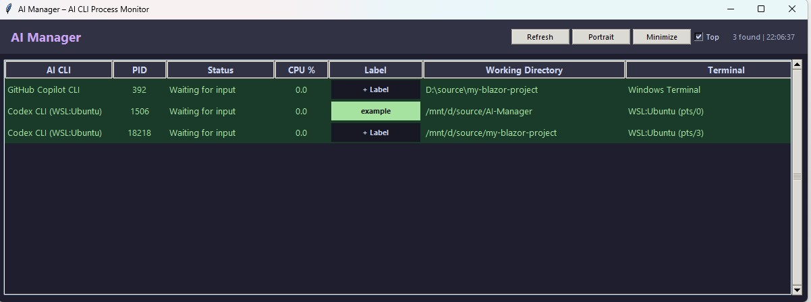
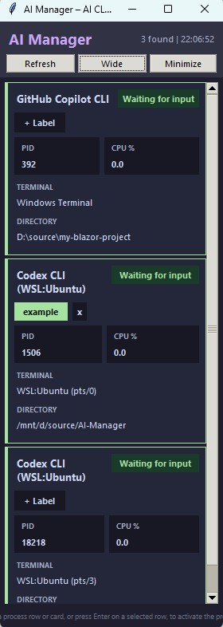
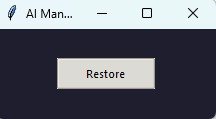

<p align="left">
  <a href="README_en.md"></a>
  <a href="README.md"></a>
</p>

# AI CLI Watcher - AI CLI Process Monitor

A Windows desktop application for monitoring the runtime status of AI CLI tools (Claude Code / Codex CLI / GitHub Copilot CLI) in real time.

- View each process status at a glance: processing or waiting for user input.
- Double-click a process to bring its window to the foreground.

## Features

| Feature | Description |
| ------- | ----------- |
| Automatic process detection | Automatically detects AI CLI processes running on Windows and WSL |
| Status display | Shows each process state as `Processing` or `Waiting for input` |
| Color-coded display | Waiting for input is shown with green-toned backgrounds; processing is shown with red-toned backgrounds |
| View mode switching | Switch between `Table` (list), `Cards` (vertical cards), and `Minimize` views. Window size and position are stored separately for each mode |
| Label management | Save a label name and color for each working directory. Labels can be edited from the Label column in `Table` view or the `+ Label` button in `Cards` view |
| Window switching | Double-click a row or card to activate that CLI's terminal window. The app also attempts to restore minimized windows |
| Working directory display | Shows the directory each CLI is running in, making it easier to distinguish multiple instances |
| Terminal type display | Shows the terminal type, such as Windows Terminal, PowerShell, or Command Prompt |
| Always on Top | The `Always on Top` checkbox keeps the window above others, and the setting is saved automatically |
| 2-second auto refresh | In `Table` and `Cards` views, the list refreshes every 2 seconds. In `Minimize` view, refresh is paused and runs immediately when you press `Restore` |

## Supported CLIs

| CLI | Windows | WSL |
| --- | ------- | --- |
| Claude Code (Anthropic) | ✅ | ✅ |
| Codex CLI (OpenAI) | ✅ | ✅ |
| GitHub Copilot CLI | ✅ | ✅ |

- Supports simultaneous detection of multiple instances of each CLI
- Can also detect processes launched via node/npm/npx
- Excludes false positives such as VS Code extension background processes and the Windows Copilot app

## Requirements

- **OS**: Windows 10 / 11
- **Python**: 3.10 or later
- **Dependencies**: psutil

## Launch

Download the `app-framework-dependent` folder from Releases, extract it, and run `AI-CLI-Watcher.exe` inside it.

Note: Running this build requires .NET 10 SDK or .NET 10 Runtime. If you are not sure whether it is installed, or if you do not want to install it, use the `app-self-contained` folder instead.

---

If you want to build from `src`, run the PowerShell script as follows.

- Framework-dependent build (if .NET 10 SDK or .NET 10 Runtime is already installed)

```powershell
.\publish.ps1 -CleanOutput
```

- Self-contained build (if you are unsure whether .NET 10 SDK / .NET 10 Runtime is installed, or do not want to install it)

```powershell
.\publish.ps1 -SelfContained -CleanOutput
```

## Usage

### Screen Layout

Displayed content changes depending on the view mode. The following images show each mode.

| View Mode | Sample Image |
| --------- | ------------ |
| `Table` |  |
| `Cards` |  |
| `Minimize` |  |

### Field Descriptions

| Field | Description |
| ----- | ----------- |
| AI CLI | The CLI name. For WSL processes, `(WSL:<distribution name>)` is appended |
| PID | Process ID |
| Status | `▶ Processing` or `⏸ Waiting for input` |
| CPU % | CPU usage of the entire process tree |
| Label | Label name. In `Table` view, the Label field shows the saved label, `+ Label` if none is set, or `No Label` if the directory is unavailable. In `Cards` view, it appears as the `+ Label` button or the saved label on the card |
| Directory | The working directory of the CLI. Long paths are shortened while preserving the end of the path |
| Terminal | The terminal type, such as Windows Terminal or PowerShell |

### Controls

| Action | Behavior |
| ------ | -------- |
| `Cards` / `Table` button | Switches between `Table` and `Cards` views. Size and position are saved independently for each view |
| `Minimize` button | Switches to a compact screen that only shows the `Restore` button |
| `Restore` button | Returns from the minimized screen to the previous view and position, then refreshes immediately |
| `+ Label` button | Click `+ Label` to add or edit a label |
| Double-click / Enter | Activates the selected CLI's terminal window and also attempts to restore minimized windows |
| `Auto refresh: 2s` display | Automatically refreshes the process list every 2 seconds |
| `Always on Top` checkbox | When enabled, the AI CLI Watcher window stays above all other windows |

Labels cannot be saved for processes whose working directory cannot be determined.

### Status Determination Logic

On both Windows and WSL, status is determined using the following two signals. If either one exceeds its threshold, the status becomes `Processing`. If both are below their thresholds, the status becomes `Waiting for input`.

| Signal | Threshold | Description |
| ------ | --------- | ----------- |
| Tree CPU | 2.0% | Total CPU usage of the process and all child processes |
| I/O Delta | 1,000 activity score | Increase in I/O activity since the previous scan. On Windows, this includes I/O operation counts in addition to bytes |

- On Windows, the app uses process-tree CPU usage and I/O counters via `psutil`
- On WSL, the app calculates CPU usage and I/O deltas from `/proc` CPU ticks and I/O information

### Settings Persistence

The following settings are saved in `settings.json` and kept after the application exits.
If `settings.json` does not exist at startup, cannot be parsed as JSON, or has an invalid settings structure, the application automatically recreates it by filling and normalizing only the managed settings with system default values.

| Setting | Storage |
| ------- | ------- |
| `Always on Top` checkbox state | `settings.json` (`always_on_top`) |
| Last normal view mode used (`Table` or `Cards`) | `settings.json` (`layout_mode`) |
| Window size and position for each view mode (`Table` / `Cards` / `Minimize`) | `settings.json` (`window_geometries.landscape` / `portrait` / `minimized`) |
| Label name and color for each working directory | `settings.json` (`process_labels`) |

## File Structure

```
AI-CLI-Watcher/
├── .gitignore                   # Root ignore settings
├── LICENSE                      # License
├── README.md                    # Japanese README
├── README_en.md                 # English README
├── publish.ps1                  # Build script for distribution
├── images/                      # Screenshot samples used in the README
│   ├── 00001.jpg
│   ├── 00002.jpg
│   └── 00003.jpg
└── src/
    ├── .gitignore               # Ignore settings for build artifacts
    ├── AI-CLI-Watcher.sln       # Solution file
    ├── AI-CLI-Watcher.csproj    # WPF project definition
    ├── App.xaml                 # Application definition
    ├── App.xaml.cs              # Application initialization
    ├── MainWindow.xaml          # Main window UI
    ├── MainWindow.xaml.cs       # Main window logic
    ├── AssemblyInfo.cs          # Assembly metadata
    ├── app_icon.ico             # Application icon
    ├── Helpers/
    │   └── ColorHelper.cs       # Color-related helper
    ├── Models/
    │   ├── AppSettings.cs       # Settings model
    │   ├── CliDefinition.cs     # Definitions of supported CLIs
    │   └── CliProcess.cs        # Detected process model
    ├── Services/
    │   ├── ProcessScanner.cs    # Windows-side process detection
    │   ├── SettingsService.cs   # Settings load/save logic
    │   ├── Win32Api.cs          # Win32 API integration
    │   └── WslScanner.cs        # WSL-side process detection
    ├── Themes/
    │   └── DarkTheme.xaml       # Theme definition
    └── Views/
        ├── LabelEditorDialog.xaml    # Label editor dialog UI
        └── LabelEditorDialog.cs      # Label editor dialog logic
```

`app/`, `src/bin/`, `src/obj/`, and `settings.json` are omitted here because they are generated during build or runtime.

## Verification Status

| Environment | CLI | Status |
| ----------- | --- | ------ |
| Windows | Claude Code | ✅ Verified |
| Windows | Codex CLI | ✅ Verified |
| Windows | GitHub Copilot CLI | ✅ Verified |
| WSL | Codex CLI | ✅ Verified |
| WSL | Claude Code | ✅ Verified |
| WSL | GitHub Copilot CLI | ✅ Verified |

## ❗This project is provided under the MIT License. See the LICENSE file for details.
